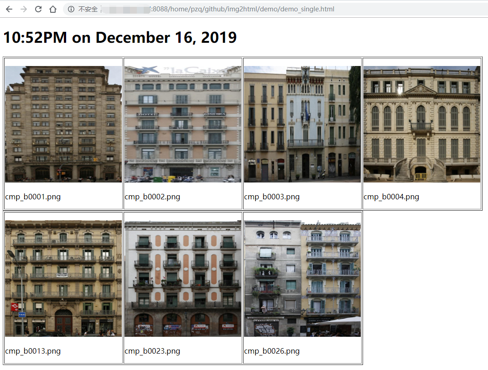
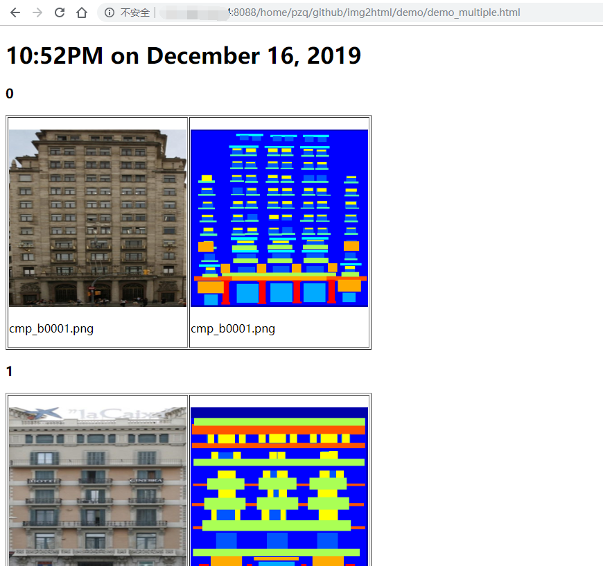

# image2html

For quick viewing images via html file.


## Install

You can install it from pip or source code.

1. pip

    ```bash
    pip install image2html
    ```

2. source code

    ```bash
    git clone https://github.com/ZQPei/image2html.git
    cd image2html
    python setup.py install # use sudo if necessary
    ```


## Usage

1. make flist

    ```bash
    # Get all the path of images in dir and save them to output file.
    make_flist [dir] [output] --keyword keyword1, keyword2 --ext ('.png', '.jpg') --recursive

    # for example
    make_flist demo_img_folder1 img_flist1.txt --keyword cmp cmp --ext ('.png', '.jpg')
    ```

2. image2html

    ```bash
    # Display all the images with specified extension in demo/iimg_folder1.
    image2html --dirs demo/img_folder1 --output demo/demo_single.html

    # Note that if there are multiple dirs, the number of images shall be equal in each directory.
    image2html --dirs demo/img_folder1 demo/img_floder2 --output demo/demo_multiple.html

    # Then you will get demo_single.html and demo_multiple.html in demo folder.
    ```

3. Use a http server to view html file on browser.
    ```bash
    # First build a http server
    build_server --port 8000

    # Then open your browser with address http://your_ip_address:8000/home/pzq/github/image2html/demo/demo_multiple.html.
    ```


## Example




